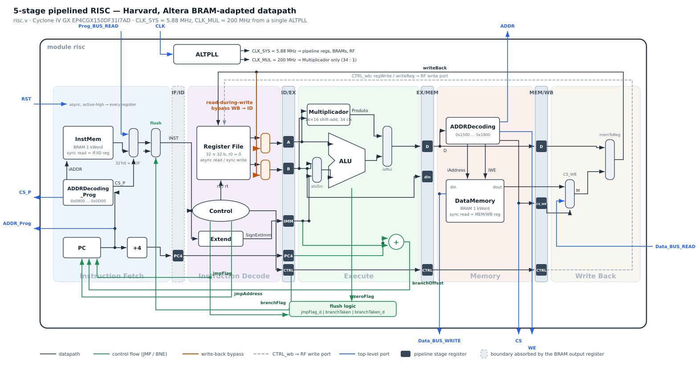

# 5-Stage Pipelined MIPS-like RISC on FPGA

A synthesizable 32-bit RISC processor in Verilog, built around a classic five-stage
pipeline — **IF · ID · EX · MEM · WB**, with a **Harvard** memory organization,
a sequential 16×16 multiplier on its own clock domain, and hazard handling shaped by
two hard constraints: Intel BRAMs are synchronous-only, and the toolchain's compiler
inserts exactly **two NOPs** after a data-producing instruction.

Target: **Cyclone IV GX EP4CGX150DF31I7AD**, Quartus Prime 18.1, ModelSim
(gate-level simulation). Academic project; the ISA, the assembler and the benchmark program were provided by the professor.



---

## Quick facts

| | |
|---|---|
| Word / instruction size | 32 bit, big endian, fixed 4-byte instructions |
| Registers | 32 × 32 bit, `r0` hard-wired to 0, async read / sync write |
| Memories | Harvard: 1 kWord instruction BRAM + 1 kWord data BRAM |
| Latency | **5 cycles** of `CLK_SYS` (pipeline fill) |
| Throughput | **1 instruction / cycle** once filled |
| `CLK_SYS` | 5.88 MHz (ALTPLL, 50 MHz × 4 ÷ 34) |
| `CLK_MUL` | 200 MHz (ALTPLL, 50 MHz × 4) |
| Fmax (TimeQuest, Slow 85 °C) | core without MUL: **89.22 MHz** · multiplier: 291.63 MHz (restricted 250 MHz) |

---

## The five stages

**IF — Instruction Fetch.** The PC addresses `ADDRDecoding_Prog`, which decides whether
the fetch lands in the internal 1 kWord instruction BRAM or on the external
`Prog_BUS_READ` bus, and drives `CS_P` to pick between the two. A second mux right
after that injects `32'h0000_0000` when a branch or jump is being resolved — that is the
flush path, described further down. `PC + 4` is computed here and carried down the
pipeline, because BNE needs it in EX.

**ID — Instruction Decode.** `control` cracks the opcode into a 15-bit `CTRL` bus and the
two source register addresses; `extend` sign-extends the 16-bit immediate; the register
file is read combinationally. JMP is *resolved here* — `control` emits `jmpFlag` and the
absolute `jmpAddress` straight to the PC, so a jump costs only one bubble.

**EX — Execute.** `aluSrc` picks the ALU's second operand (register `B` or the immediate),
`aluControl` selects add / sub / and / or, and `isMul` selects between the ALU result and
the sequential multiplier's `Produto`. The branch target `PC4 + SignExtImm` is computed in
parallel by a dedicated adder, and `zeroFlag` (`A == B`) resolves BNE here.

**MEM — Memory.** The effective address `D` goes to `ADDRDecoding`, which splits the
internal data BRAM from the external data bus (`CS`, `WE`, `ADDR`, `Data_BUS_WRITE`,
`Data_BUS_READ`) and produces the word index `internalAddress` / `iAddress` plus the
internal write enable `iWE`.

**WB — Write Back.** One mux picks internal `dout` versus external `Data_BUS_READ`
(steered by `CS_WB`), a second picks memory data versus the ALU/MUL result
(`memToReg`), and the result goes back into the register file's write port as
`writeBack`.

### The `CTRL` bus

Control is decoded once in ID and then travels with the instruction through every
boundary register, so each stage reads only the slice it needs:

| Bits | Field | Consumed in |
|---|---|---|
| `[14]` | `branchFlag` | EX |
| `[13]` | `isMul` | EX |
| `[12:10]` | `aluControl` | EX |
| `[9]` | `aluSrc` | EX |
| `[8]` | `memToReg` | WB |
| `[7]` | `memRead` | MEM |
| `[6]` | `memWrite` | MEM |
| `[5]` | `regWrite` | WB |
| `[4:0]` | `writeReg` | WB |

Opcode `0` decodes to an all-neutral `CTRL`, which is what makes `32'h0000_0000` a
harmless NOP and lets the flush mux work at all.

---

## Harvard organization and the memory map

Instructions and data live in two physically separate 1 kWord BRAMs, each with its own
address decoder. Beyond the obvious structural-hazard benefit (IF and MEM both touch
memory in the same cycle and never contend), the split is what lets the two address
decoders have completely independent internal/external windows.

The assignment requires different bases for each group, this design is group 3, so the bases are:

| Region | Base | End | Decoder |
|---|---|---|---|
| Program | `0x0000_0900` | `0x0000_0D00` | `ADDRDecoding_Prog` → `CS_P`, `iADDR` |
| Data | `0x0000_1500` | `0x0000_1900` | `ADDRDecoding` → `CS`, `internalAddress`, `iWE`, `WE` |

Addresses outside a window simply deassert the chip select and the access is routed to
the external bus instead. `RST` puts the PC at `0x0000_0900`, the group's program base.

> **Note on `Code.hex`.** The PC counts in *bytes* (`+4`), while a Quartus `.hex`
> initializes a BRAM by *word index*. `ADDRDecoding_Prog` passes the byte offset through
> as the index, so consecutive instructions land at word indices 0, 4, 8, … — which is
> exactly what the generated `Code.hex` contains. Data, addressed by `lw`/`sw` with a
> word-granular offset, is packed densely at indices 0…31 in `Data.hex`.

---

## Two clock domains

The multiplier is the shift-and-add sequential design from an earlier assignment, widened
to 16×16. It takes `2N + 2 = 34` clocks to produce a product, but the pipeline must
absorb it inside a **single** EX stage to keep the 1 instruction/cycle throughput. So a
single ALTPLL emits both clocks at a fixed **34 : 1** ratio:

```
CLK (50 MHz) ──► ALTPLL ─┬─► CLK_MUL = 50 × 4      = 200 MHz   (Multiplicador only)
                         └─► CLK_SYS = 50 × 4 / 34 = 5.88 MHz  (everything else)
```

The ×4 is deliberate headroom: at the raw 50 MHz reference the ratio would leave no
slack for the multiplier's FSM to settle before the EX stage closes.

**No metastability risk.** Both clocks come from the same PLL, at an integer ratio and
zero phase offset, they are *mesochronous*, not independent domains. Synchronizers
would only be needed if the two clocks came from separate PLLs or oscillators.

**And this is the system's bottleneck.** The core on its own closes at 89.22 MHz; the
34 : 1 division drags the whole machine down to 5.88 MHz. Ways out, with their cost:

| Change | Latency | Throughput |
|---|---|---|
| Combinational multiplier (or a DSP block) | 5 cycles | 1 instr/cycle |
| Pipelined multiplier in *k* stages | 5 + (k − 1) cycles | 1 instr/cycle |
| Trim the sequential FSM to 2N = 32 clocks | 5 cycles | 1 instr/cycle, Fmax = Fmax_MUL / 32 |

The first two remove the ÷34 entirely, so the system Fmax becomes the core's Fmax.

---

## Control hazards: flushing without a flush pin

Taken branches and jumps leave already-fetched wrong-path instructions in the pipe. The
textbook fix is to clear the affected stage registers, but here the IF/ID register
**does not exist as a register of ours**. Figure 1b of the assignment removes it because
an Altera BRAM is synchronous-read: its output register *is* the IF/ID boundary. And
that register lives inside the hard block, with no clear or flush input exposed.

So the flush happens one step later, on the *combinational* path between the BRAM output
and the decoder: a mux forces `INST` to `32'h0000_0000`. Since opcode 0 decodes to a
neutral `CTRL`, the bubble then propagates on its own, every downstream stage register
latches a harmless NOP, which is functionally identical to having reset them.

How many bubbles depends on where the decision is made:

```
JMP  — resolved in ID → 1 wrong-path instruction  → flush = jmpFlag_d
BNE  — resolved in EX → 2 wrong-path instructions → flush = branchTaken | branchTaken_d
```

which is exactly the flush term in `risc.v`:

```verilog
wire branchTaken = branchFlag & ~zeroFlag;
assign flush = jmpFlag_d | branchTaken | branchTaken_d;
```

The one-cycle-delayed copies (`_d`) exist because the flag is asserted while the *wrong*
instruction is still being read out of the BRAM; it only reaches the `INST` mux on the
following cycle. JMP needs only the delayed copy; BNE needs the current one *and* the
delayed one, because it kills two slots.

---

## Data hazards: why 2 NOPs need a bypass

This is the subtlest part of the design, and it comes from a mismatch between what the
hardware naturally supports and what the supplied compiler emits.

The compiler resolves data hazards in software, by padding **two** NOPs between a
producer and its consumer. Count the cycles for a producer `I` and a consumer `I+3`
(with two NOPs in between):

```
cycle:      c0   c1   c2   c3   c4   c5
I           IF   ID   EX   MEM  WB
NOP              IF   ID   EX   MEM  WB
NOP                   IF   ID   EX   MEM
I+3                        IF   ID   EX      ← needs the operand here
```

`I` is in **WB** during `c4`. `I+3` is in **ID** during that very same cycle, and the
register file writes on the *rising edge at the end of* `c4`. The register file's read is
asynchronous, so during `c4` it still returns the **stale** value. `ID_EX_A` / `ID_EX_B`
latch that stale value on the same edge that the write commits. The correct value would
only become visible to an instruction decoding in `c5`, therefore the hardware
requirement is **three NOPs**, but the compiler gives two.

Rewriting the compiler was not an option, and a third NOP could not be injected without
breaking the supplied program. The fix is a **read-during-write bypass**: when the
register the ID stage is reading is exactly the one the WB stage is writing *this cycle*,
forward `writeBack` combinationally into the read port instead of the register file
output.

```verilog
wire bypass1 = wb_regWrite && (wb_writeReg != 5'd0) && (wb_writeReg == rdAddress1);
wire bypass2 = wb_regWrite && (wb_writeReg != 5'd0) && (wb_writeReg == rdAddress2);
wire [31:0] rsVal_bp = bypass1 ? writeBack : rsVal;
wire [31:0] rtVal_bp = bypass2 ? writeBack : rtVal;
```

`writeBack` is already settled during `c4` — it is the MEM/WB stage output, either the
pipelined ALU/MUL result `D_wb` or the data memory's `dout`. Routing it back into ID
gives the register file "write-first" semantics from the pipeline's point of view, and
`I+3` latches the correct operand into `ID_EX_A`/`ID_EX_B` at the end of `c4`, ready for
its EX stage in `c5`. Two NOPs are now sufficient.

The `!= 5'd0` guard matters: `r0` is hard-wired to zero and is never written, so a WB
targeting `r0` must not be forwarded.

One more alignment detail of the same flavour, in MEM: `CS` is combinational off the
effective address, but the BRAM read it selects only lands one cycle later. `CS_WB` is a
one-cycle-delayed copy of `CS`, so the WB mux picks internal-vs-external data in the
cycle the data is actually valid.

---

## Verification

Every module has its own testbench (`*_TB.v`), and `risc_TB.v` exercises the whole core
running the course's `prog_avaliacao.asm` — a program deliberately written in two halves,
first *with* a data hazard and then with the same loop padded with NOP bubbles. It sums
`Mem[0..31]`, multiplies the sum by `0x00FF`, and stores the result at the last data
word. The testbench self-checks three landmarks:

| Check | Expected |
|---|---|
| `writeBack` reaches `r10` | `496` (= 0 + 1 + … + 31) |
| `writeBack` reaches `r20` | `126480` (= 496 × 255, through the multiplier) |
| `SW` to the last data word | `ADDR = 0x18FF`, `Data_BUS_WRITE = 126480` |

### Making internal signals survive gate-level simulation

The assignment requires gate-level simulation with the named nets of figure 1b visible,
observed through `$init_signal_spy`. That turned out to be the fiddliest part of the
whole project, and two workarounds in `risc.v` are worth knowing about:

- **1-bit signals are declared as `wire [0:0]`, not as scalars.** Quartus preserves
  *named buses* in the gate-level netlist, but renames scalar combinational nets to
  things like `branchFlag~combout` — and then `$init_signal_spy` cannot find the exact
  name. Declaring `wire [0:0] branchFlag` keeps the net named `branchFlag`.
  Functionally identical, no width warnings.
- **`(*keep=1*)` is necessary but not sufficient.** Intel's own documentation notes it
  "cannot be used for nodes that have no fan-out". `internalAddress` was fanout-free and
  got pruned despite the attribute; the fix was to derive `iAddress` from it *at the top
  level* (`assign iAddress = internalAddress[9:0];`) rather than inside `ADDRDecoding`,
  giving it real fan-out so it survives synthesis.

---

## Repository layout

```
risc.v                 structural top level — wires all stages together
risc_TB.v              full-core testbench (RTL and gate-level)

pc.v                   program counter with jmp / branch inputs
ADDRDecoding_Prog.v    instruction-memory address decoder (internal vs external)
InstMem.v              1 kWord instruction BRAM (altsyncram)  + Code.hex
control.v              opcode → 15-bit CTRL, jmpFlag, jmpAddress
extend.v               16 → 32 bit sign extension
registerfile.v         32 × 32 b, async read, sync write, r0 = 0
alu.v                  add / sub / and / or + zeroFlag
Multiplicador/         16×16 sequential shift-add multiplier (CLK_MUL domain)
ADDRDecoding.v         data-memory address decoder
datamemory.v           1 kWord data BRAM (altsyncram)  + Data.hex
register.v, mux.v      parameterized pipeline register and 2:1 mux
PLL/                   ALTPLL IP — CLK_SYS and CLK_MUL

prog_avaliacao.asm     course benchmark program
Code.hex / Data.hex    memory initialization images
risc.sdc, risc.qsf     timing constraints and Quartus project settings
```

## Instruction set

Group offset is 3, so `Grupo+10 = 13` for R-type and `Grupo+32 = 35` for `LW`, etc.

| Instr. | Fmt | Opcode | Operation |
|---|---|---|---|
| `LW`   | I | 35 | `R[rt] = M[R[rs] + SignExtImm]` |
| `SW`   | I | 36 | `M[R[rs] + SignExtImm] = R[rt]` |
| `BNE`  | I | 37 | `if (R[rs] != R[rt]) PC = PC + 4 + offset` |
| `ADDI` | I | 38 | `R[rt] = R[rs] + SignExtImm` |
| `ORI`  | I | 39 | `R[rt] = R[rs] \| SignExtImm` |
| `ADD`  | R | 13 / funct 32 | `R[rd] = R[rs] + R[rt]` |
| `SUB`  | R | 13 / funct 34 | `R[rd] = R[rs] - R[rt]` |
| `AND`  | R | 13 / funct 36 | `R[rd] = R[rs] & R[rt]` |
| `OR`   | R | 13 / funct 37 | `R[rd] = R[rs] \| R[rt]` |
| `MUL`  | R | 13 / funct 50 | `R[rd] = R[rs][15:0] * R[rt][15:0]` |
| `JMP`  | J | 2  | `PC = PROG_BASE + JumpADDR` |

All modules use the same reset convention: **asynchronous, active high**.
